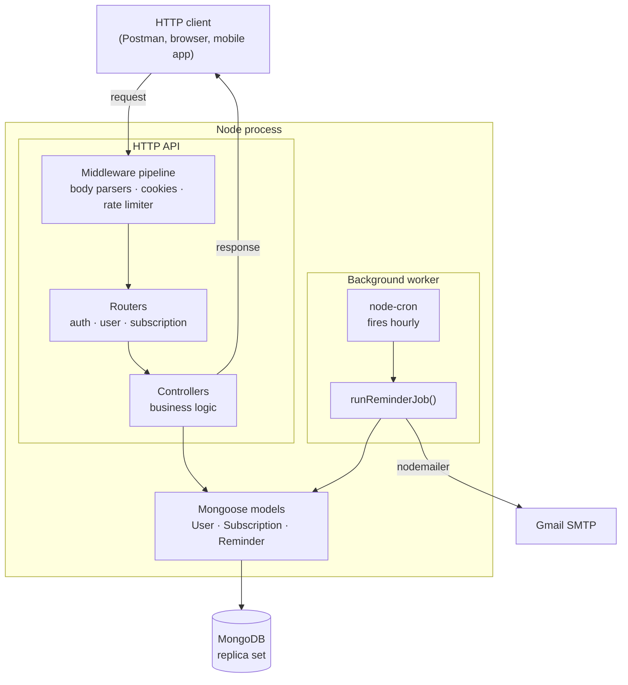
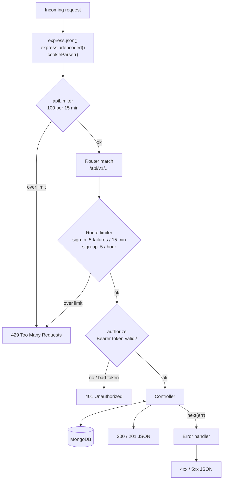
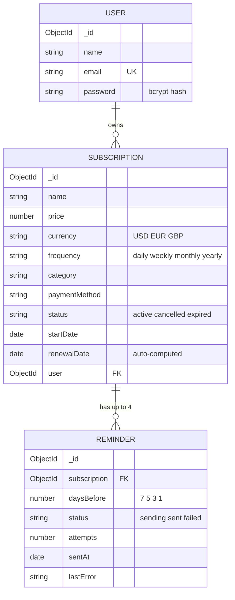
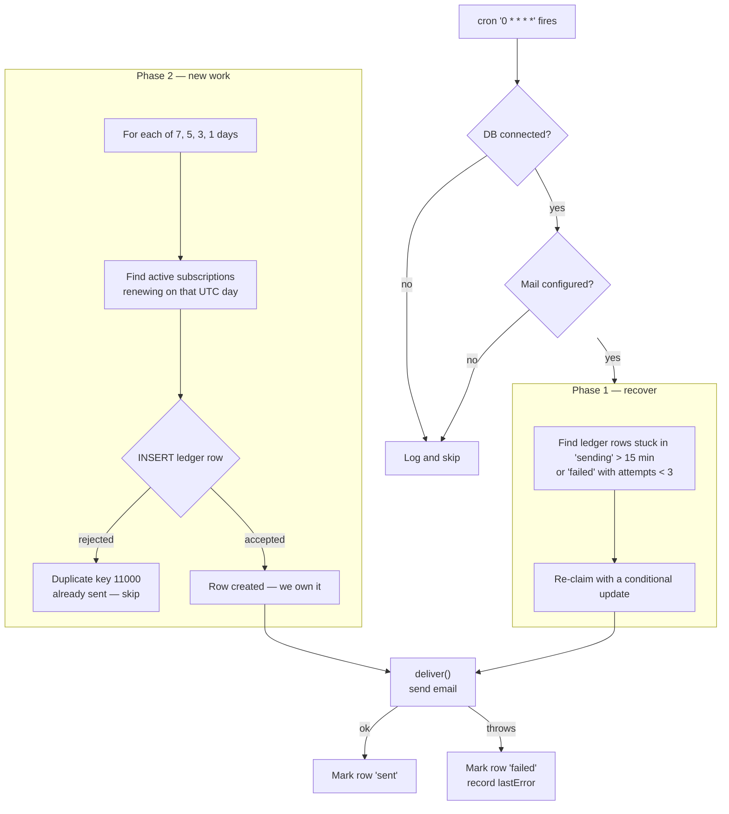
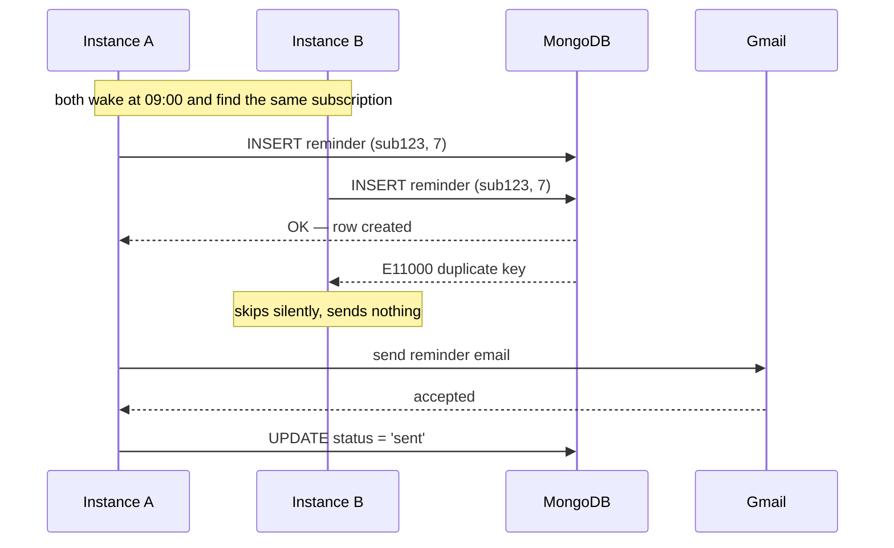

# SubTracker

A subscription tracking REST API. Users register, record the subscriptions they pay for, and receive email reminders before each renewal date so a charge never arrives unannounced.

Built with Node.js, Express and MongoDB.

---

## Contents

- [Stack](#stack)
- [Architecture](#architecture)
- [Project structure](#project-structure)
- [Request lifecycle](#request-lifecycle)
- [API reference](#api-reference)
- [Data model](#data-model)
- [The reminder worker](#the-reminder-worker)
- [Running locally](#running-locally)
- [Environment variables](#environment-variables)
- [Known issues](#known-issues)

---

## Stack

| Concern | Choice |
| --- | --- |
| Runtime | Node.js 25 (ES modules) |
| Web framework | Express 4 |
| Database | MongoDB 8 via Mongoose 9 |
| Authentication | JWT (`jsonwebtoken`) + bcrypt password hashing |
| Rate limiting | `express-rate-limit` |
| Scheduling | `node-cron` |
| Email | `nodemailer` over Gmail SMTP |

---

## Architecture

The application is two independent halves that share a database and nothing else: an **HTTP API** that serves requests, and a **background worker** that runs on its own clock.



**The important property:** no controller ever calls the worker. Creating a subscription does not schedule an email. The worker discovers new subscriptions on its own, later, by querying for them. The two halves are joined only through MongoDB.

This is the same separation as an ASP.NET Core `BackgroundService` registered alongside your controllers.

---

## Project structure

```
app.js                          entry point — builds the pipeline, starts the server and the worker
config/
  env.js                        loads .env.<NODE_ENV>.local and re-exports the variables
  nodemailer.js                 Gmail SMTP transport
database/
  mongodb.js                    connectToDb() — opens the Mongoose connection
middlewares/
  auth.middleware.js            authorize — verifies the Bearer token, attaches req.user
  error.middleware.js           central error handler
  rateLimit.middleware.js       apiLimiter · signInLimiter · signUpLimiter
models/
  user.model.js                 User schema
  subscription.model.js         Subscription schema + pre-save hook
  reminder.model.js             Reminder ledger + unique index
routes/
  auth.routes.js                /api/v1/auth
  user.routes.js                /api/v1/user
  subscription.routes.js        /api/v1/subscription
controllers/
  auth.controller.js            signUp · signIn · signOut
  user.controller.js            getUsers · getUser
  subscription.controller.js    createSubscription · getUserSubscriptions
jobs/
  reminder.job.js               the worker: query, claim, send, retry
utils/
  emailTemplate.js              renewal reminder subject + HTML + text
```

---

## Request lifecycle

Middleware runs in registration order. Each layer can end the request early by responding instead of passing control on — which is exactly how the rate limiter and the auth guard work.



Not every route passes through every stage — `authorize` and the strict limiters are attached per route, not globally.

---

## API reference

Base URL: `http://localhost:5500/api/v1`

Routes marked **auth** require an `Authorization: Bearer <token>` header, obtained from sign-in.

### Auth — `/auth`

| Method | Path | Auth | Description |
| --- | --- | --- | --- |
| `POST` | `/sign-up` | — | Create an account. Returns a JWT. Limited to 5 per hour per IP. |
| `POST` | `/sign-in` | — | Exchange credentials for a JWT. Limited to 5 failed attempts per 15 min. |
| `POST` | `/sign-out` | — | Not yet implemented |

### Users — `/user`

| Method | Path | Auth | Description |
| --- | --- | --- | --- |
| `GET` | `/` | — | List all users |
| `GET` | `/:id` | auth | Fetch one user (password excluded) |
| `POST` | `/` | — | Not yet implemented |
| `PUT` | `/:id` | — | Not yet implemented |
| `DELETE` | `/:id` | — | Not yet implemented |

### Subscriptions — `/subscription`

| Method | Path | Auth | Description |
| --- | --- | --- | --- |
| `POST` | `/` | auth | Create a subscription for the signed-in user |
| `GET` | `/user/:id` | auth | List a user's subscriptions. Returns 403 for another user's id. |
| `GET` | `/` | — | Not yet implemented |
| `GET` | `/:id` | — | Not yet implemented |
| `PUT` | `/:id` | — | Not yet implemented |
| `DELETE` | `/:id` | — | Not yet implemented |
| `PUT` | `/:id/cancel` | — | Not yet implemented |
| `POST` | `/upcomming-renewals` | — | Not yet implemented |

### Example — create a subscription

```http
POST /api/v1/subscription
Authorization: Bearer <token>
Content-Type: application/json

{
  "name": "netflix premium",
  "price": 15.99,
  "currency": "USD",
  "frequency": "monthly",
  "category": "entertainment",
  "startDate": "2026-09-03T00:00:00.000Z",
  "paymentMethod": "Credit card"
}
```

`renewalDate` and `status` are filled in automatically by a pre-save hook. Do not send a `user` field — it is taken from the token.

---

## Data model



`REMINDER` carries a **unique index on `(subscription, daysBefore)`**. That constraint is what makes duplicate emails impossible — see below.

---

## The reminder worker

Every hour the worker asks which subscriptions renew in exactly 7, 5, 3 or 1 days, and emails their owners once per reminder point.

### How one run works



### Why it cannot send twice

The naive approach is a race condition:

```js
if (alreadySent) return;   // two servers both pass this check
await sendEmail();         // both send
```

Instead the worker **claims** the right to send by inserting a row into the `Reminder` ledger. The unique index on `(subscription, daysBefore)` means the database allows exactly one insert to succeed. A second attempt fails with error `11000`, which the worker treats as "already handled" and skips.

The database arbitrates, not application logic — so this is correct across any number of server instances with no lock and no transaction.



### Design notes

- **Hourly, not daily.** Repeat runs are free — every insert after the first is rejected — so running 24 times a day costs nothing and means a few hours of downtime cannot lose a reminder.
- **Recover before new work.** Each run first retries rows abandoned by a crashed process or left failed by a mail outage.
- **`deliver()` never throws.** A failure is written to `lastError` and returned normally, so one bad address cannot abort a batch of 500.
- **At-least-once.** If the process dies between the email leaving and the row being marked `sent`, the retry may send a second copy. That trade-off is deliberate: for a renewal reminder, a rare duplicate beats silence.
- **Times are UTC.** "7 days from now" is computed in UTC, so users far from UTC may see a reminder some hours early or late.

---

## Running locally

### Prerequisites

- Node.js 20 or newer (developed on 25)
- Docker, for MongoDB
- A Gmail account with 2FA enabled, if you want reminder emails to actually send

### 1. MongoDB as a single-node replica set

The API uses a transaction in `signUp`, and **transactions require a replica set** — a standalone `mongod` will fail with *"This MongoDB deployment does not support retryable writes."*

Start one:

```bash
docker run -d --name mongodb -p 27017:27017 -v mongodb-data:/data/db mongo:8 --replSet rs0
```

Then initiate it. The `host` must be `localhost:27017`, not the container's internal hostname, or your Node process will not be able to reach the member it discovers:

```bash
docker exec mongodb mongosh --quiet --eval 'rs.initiate({_id:"rs0",members:[{_id:0,host:"localhost:27017"}]})'
```

Confirm it reached `PRIMARY`:

```bash
docker exec mongodb mongosh --quiet --eval 'rs.status().members[0].stateStr'
```

### 2. Install dependencies

```bash
npm install
```

### 3. Create the environment file

Create `.env.development.local` in the project root:

```
PORT=5500
NODE_ENV=development
DB_URI="mongodb://localhost:27017/subtracker"
JWT_SECRET="a-long-random-string"
JWT_EXPIRES="7d"
EMAIL_USER=
EMAIL_PASSWORD=
```

`EMAIL_USER` is your Gmail address. `EMAIL_PASSWORD` must be a **Google App Password**, not your account password — generate one at [myaccount.google.com/apppasswords](https://myaccount.google.com/apppasswords) with 2FA enabled.

Leave both blank and the app still runs; the reminder worker logs that it is skipping and does nothing.

### 4. Run

```bash
npm run dev     # nodemon, restarts on change
npm start       # plain node
```

You should see:

```
Example app listening on port ${PORT}} 5500
Connected
[reminders] scheduled hourly
```

### 5. Try it

```bash
curl -X POST http://localhost:5500/api/v1/auth/sign-up \
  -H 'content-type: application/json' \
  -d '{"name":"Perfect","email":"you@example.com","password":"Calyster123"}'
```

Copy the `token` from the response and use it for the authenticated routes:

```bash
curl http://localhost:5500/api/v1/subscription/user/<userId> \
  -H 'Authorization: Bearer <token>'
```

### Testing reminders without waiting

The worker runs on the hour. To see it work immediately, create a subscription whose `renewalDate` is exactly 7, 5, 3 or 1 days out, then call the exported `runReminderJob()` directly from a scratch script, or temporarily change the cron expression in `jobs/reminder.job.js` to `'*/1 * * * *'` (every minute).

---

## Environment variables

| Variable | Required | Description |
| --- | --- | --- |
| `PORT` | yes | Port the API listens on |
| `NODE_ENV` | yes | Selects which `.env.<NODE_ENV>.local` file is loaded |
| `DB_URI` | yes | MongoDB connection string. Must start with `mongodb://` or `mongodb+srv://` |
| `JWT_SECRET` | yes | Signing key for JSON Web Tokens |
| `JWT_EXPIRES` | yes | Token lifetime, e.g. `7d` |
| `EMAIL_USER` | no | Gmail address used as the sender |
| `EMAIL_PASSWORD` | no | Gmail **App Password** |

Environment files are gitignored (`.env*.local`) and must never be committed.

---

## Known issues

Open items, listed so they are not mistaken for finished work.

| Area | Issue |
| --- | --- |
| Security | `GET /api/v1/user` has no `authorize` guard and `getUsers` does not exclude the password field, so an unauthenticated request returns every user's bcrypt hash |
| Security | `signIn` returns the full user document, including the password hash |
| Bug | `app.use(errorMidleware)` is registered above the routes in `app.js`, so the error handler never fires and failures return Express's default HTML page instead of JSON |
| Bug | `error.middleware.js` line 3 reads `let error = { ...error }`, which throws `ReferenceError: Cannot access 'error' before initialization`. It should spread `err` |
| Bug | The duplicate-key branch in `error.middleware.js` checks `err.name === 'ValidationError'`; real duplicate keys surface as `MongoServerError` with `code === 11000` |
| Correctness | `Subscription.startDate` validates `v <= new Date()`, forbidding future start dates, while its message says the opposite |
| Correctness | `frequency` has an enum but is not `required`; a missing value produces an Invalid Date in the pre-save hook |
| Cosmetic | `app.js` logs `'...port ${PORT}}'` in single quotes, printing the placeholder literally |
| Scope | Most subscription and user routes are still placeholder handlers |
